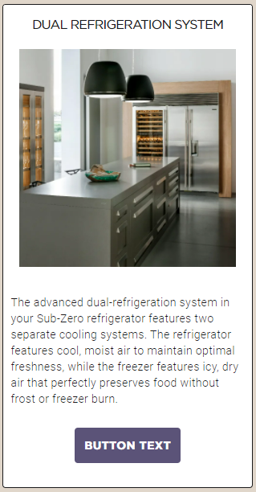
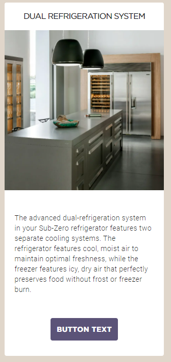
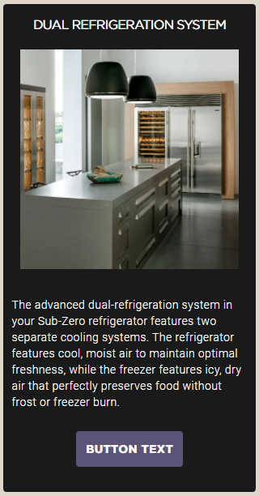
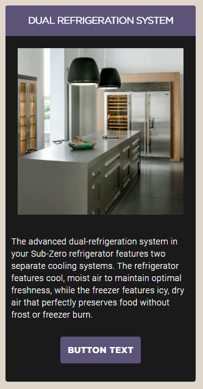
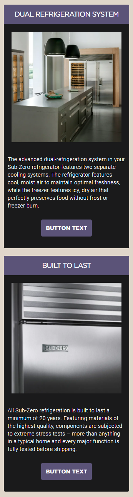
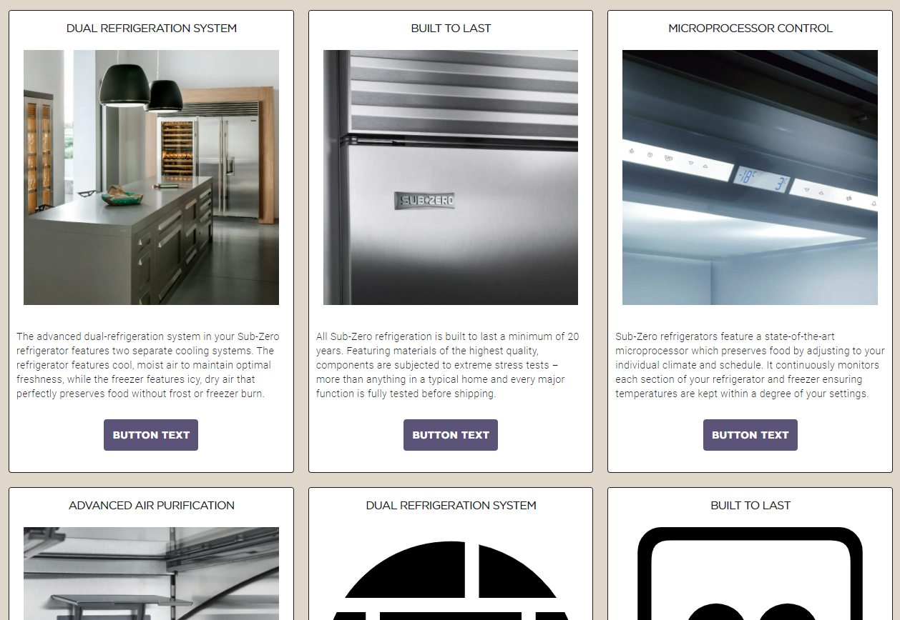
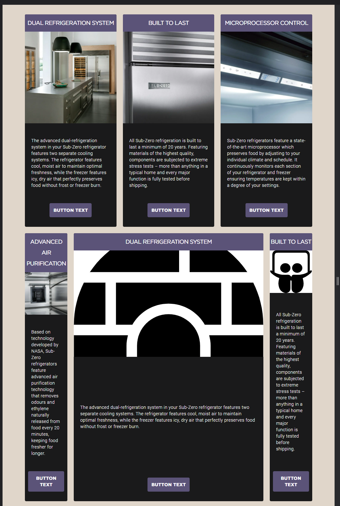
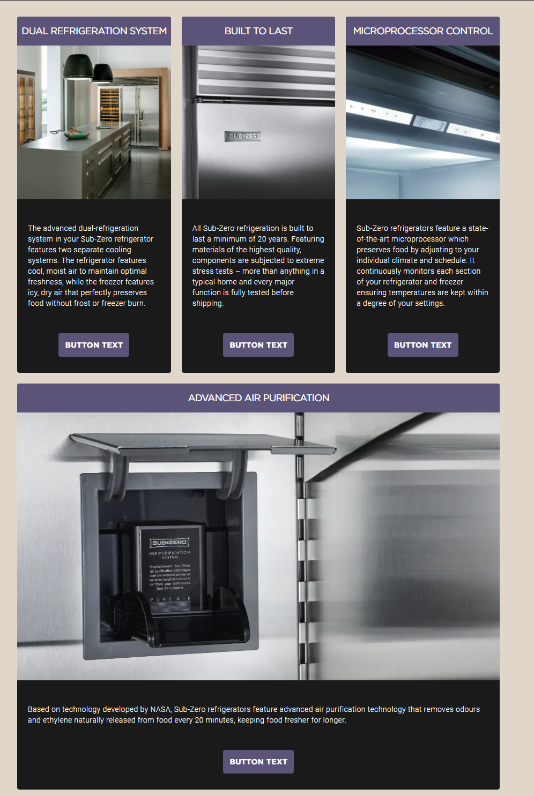

# Card and SZ Theme Cheat Sheet

Mobile first tool create a simple card system along with color themes.

## Card initiation
To start a card grid add card and grid classes, at least one general grid class is needed, eg. `grid-col-3` for 3 items per row. No breakpoints needed. If using breakpoints for responsiveness, please start low and then go up (mobile first) in number, eg `grid-col-1 grid-col-s-2 grid-col-m-3 grid-col-l-4 grid-col-xl-5`. *****It is important to rememember this is a mobile first tool, when adding `grid-col-#` add the smallest number for the smallest screen and then go up from there, eg. `grid-col-1 grid-col-m-2 grid-col-l-3`

`card grid-col-1 item-spacing--regular`

### Card class
| Class | Selector | Info |
|-------|----------|----- |
|`card` |general / individual | initiates a general or individual card |
|`card--marginless-layout` |general / individual | removes margins from img and card borders |
|`card--inverted-layout` |general / individual | inverts image and title, making it from top to bottom img > title > p > button |

`card` class  

`card--marginless-layout` class  

`card--inverted-layout` class  

### SZ Themes

| Class  | Info |
|-------|----- |
| `card--sz-minimal-dark`|like the `card` class but in black |
|`card--sz-dark-theme`| purple and black|
|`card--sz-light-theme`| purple and white|

`card--sz-minimal-dark` class  

`card--sz-dark-theme` class  

`card--sz-light-theme` class  

## Grid

| Class | Selector | Range |  Info |
|-------|----------|----- | ----- |
|`grid-col-#` |general / individual| 1 - 8 | specifies ammount of items per row |
|`double-size` |general / individual| N/A | doubles the size of the item according to the general/individual selector's number of items per row |
|`half-size` |general / individual| N/A | same as `double-size` but halfs it |
|`full-row` | individual| N/A | makes the element take 100% of the row |

`grid-col-1` class  

`grid-col-2` class  

`grid-col-3` class  
  

`half-size` class and `double-size` class  

`full-row` class  
  

	Grid Breakpoints

| Class | Selector | Range |  Width |
|-------|----------|----- | ----- |
|`grid-col-xs-#` |general / individual| 1 - 8 | up to 480px |
|`grid-col-s-#` |general / individual| 1 - 8 | up to 768px |
|`grid-col-m-#` |general / individual| 1 - 8 | up to 1366px |
|`grid-col-l-#` |general / individual| 1 - 8 | up to 1920px (1080p) |
|`grid-col-xl-#` |general / individual| 1 - 8 | 2560px + (2k/QHD)|

Examples of grid, all images have the same classes, at a different viewport.

#### `card grid-col-1 grid-col-s-2 grid-col-m-3 grid-col-l-4 grid-col-xl-5 item-spacing--regular card--marginless-layout card--sz-dark-theme`  

  

